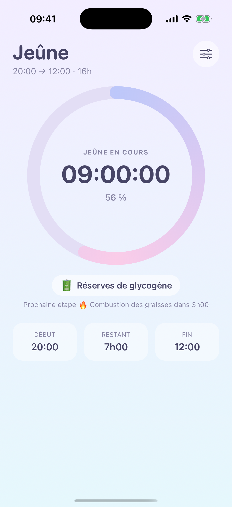
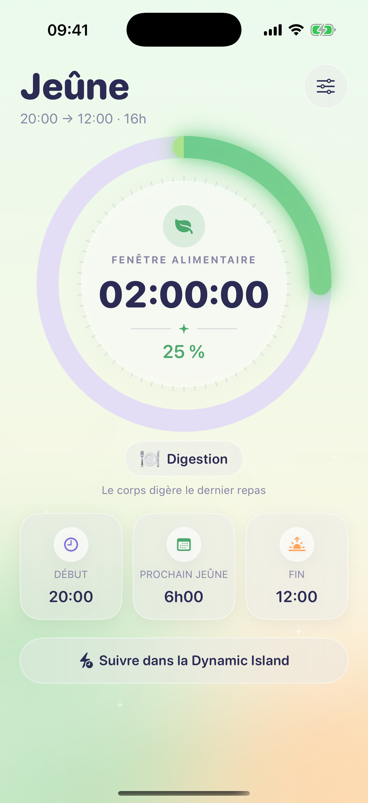
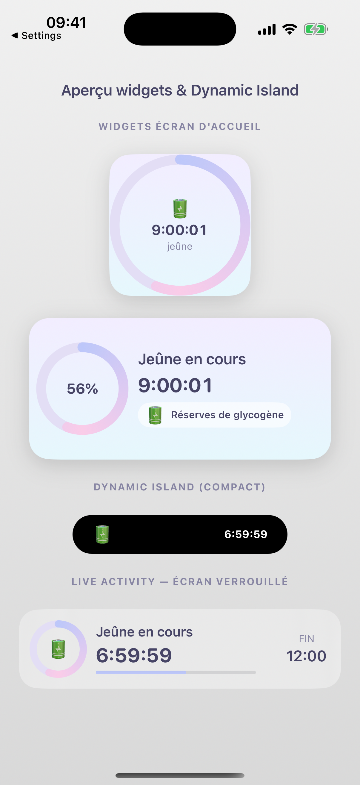
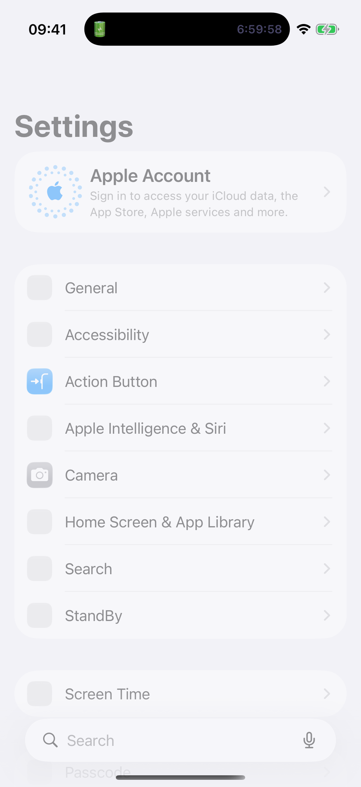

# Jeûne — app de fasting iOS

App iOS native (SwiftUI + WidgetKit) pour suivre l'état de son jeûne intermittent.

## Captures
| Jeûne en cours | Fenêtre alimentaire |
|:---:|:---:|
|  |  |

| Widgets & Live Activity | Dynamic Island (en situation) |
|:---:|:---:|
|  |  |

## Fonctionnalités
- **Configuration** : uniquement l'heure de **début** et de **fin** du jeûne (réglages, deux sélecteurs d'heure).
- **Écran principal** : anneau de progression pastel, **temps écoulé** en direct, **état d'avancement** métabolique (Digestion → Glycémie → Glycogène → Combustion des graisses → Cétose → Autophagie), et la phase en cours (jeûne / fenêtre alimentaire).
- **Notifications locales** quotidiennes au **début** et à la **fin** du jeûne.
- **Widgets écran d'accueil** (petit + moyen) + widget rond pour l'écran verrouillé, alimentés via un **App Group** partagé.
- **Live Activity / Dynamic Island** : suivi en direct du jeûne dans la Dynamic Island et sur l'écran verrouillé (chrono et progression qui avancent tout seuls, sans push). Bouton *Suivre / Arrêter le suivi en direct* dans l'app.
- Thème **pastel** (lavande / pêche / menthe) partagé entre l'app, les widgets et la Live Activity.

## Structure
```
Fasting/            target app (écran principal, réglages, notifications, icône)
FastingWidget/      target widget extension (WidgetKit)
Shared/             code partagé app + widget (modèle, store App Group, palette, vues, contenu widget)
Fasting.xcodeproj/  projet Xcode (2 targets : Fasting + FastingWidget)
```
- Bundle id app : `company.lno.fasting` — widget : `company.lno.fasting.FastingWidget`
- App Group : `group.company.lno.fasting`
- Cible iOS minimum : 17.0
- Jeûne par défaut : **20:00 → 12:00** (16:8), modifiable dans l'app.

## Ouvrir / lancer
```bash
open ~/fasting-app/Fasting.xcodeproj
```
Choisir le scheme **Fasting**, un simulateur ou son iPhone, puis ▶︎.

> ⚠️ **Runtime simulateur.** Ce Mac a Xcode 26.5 mais pas le runtime simulateur iOS 26.5
> (seuls 18.6 / 26.3 / 26.4 sont installés). Pour compiler avec l'icône/les assets,
> installer le runtime correspondant via **Xcode → Settings → Components**, *ou* lancer
> sur un iPhone physique (nécessite aussi d'installer le support de plateforme iOS dans
> Components). Le code Swift, lui, compile déjà sans erreur.

## CI / Build cloud (GitHub Actions)
[](https://github.com/JeremyLNO/fasting-ios/actions/workflows/ios.yml)

À chaque push sur `main`, un runner macOS compile l'app **et** le widget (avec l'icône et les
assets — le cloud dispose du runtime simulateur qui manque en local) et publie le `.app` en
artefact téléchargeable : onglet **Actions** → dernier run → section *Artifacts*.

### Plus tard : distribution TestFlight
Avec un **compte Apple Developer (99 $/an)** :
1. Créer l'app dans App Store Connect (bundle `company.lno.fasting`).
2. Générer une **clé API App Store Connect** (Issuer ID, Key ID, fichier `.p8`).
3. Les ajouter en **secrets** du repo : `ASC_KEY_ID`, `ASC_ISSUER_ID`, `ASC_KEY_P8`.
4. On branche alors un job `archive` signé (signature cloud via `-allowProvisioningUpdates`) →
   upload TestFlight. (Dis-le-moi quand le compte est prêt, je l'ajoute.)

## Déployer sur son iPhone (compte Apple gratuit)
1. Brancher l'iPhone, le sélectionner comme destination.
2. Dans **Signing & Capabilities** des deux targets : choisir son équipe (Personal Team),
   et vérifier la capability **App Groups** = `group.company.lno.fasting`.
3. ▶︎ pour installer. Sur l'iPhone : Réglages → Général → VPN et gestion → faire confiance au profil.
4. Ajouter le widget : appui long sur l'écran d'accueil → **+** → chercher « Jeûne ».

## Arguments de lancement (dev uniquement)
- `-skipNotifPrompt` : ne pas demander l'autorisation notifications (captures propres).
- `-demoNow <timestamp>` : fige l'heure « maintenant » (démo).
- `-widgetGallery` : affiche l'aperçu in-app des widgets.
