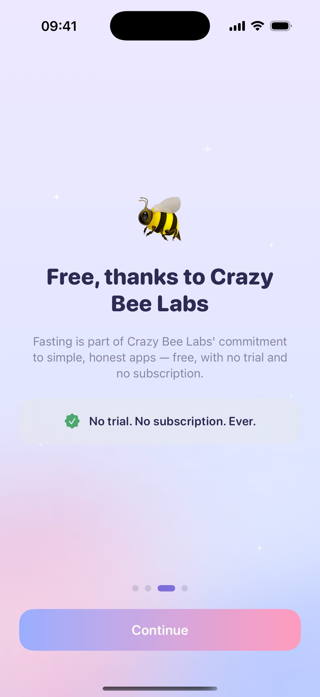

# Fasting — app de jeûne iOS

App iOS native (SwiftUI + WidgetKit) pour suivre l'état de son jeûne intermittent.

## Captures
| Jeûne en cours | Fenêtre alimentaire |
|:---:|:---:|
|  |  |

| Widgets & Live Activity | Dynamic Island (en situation) |
|:---:|:---:|
|  |  |

| Onboarding | Engagement gratuit (onboarding) |
|:---:|:---:|
|  |  |

| Historique | Icône (écran d'accueil) |
|:---:|:---:|
|  |  |

| Interrompre le jeûne (tap) | Démarrer le jeûne (tap) |
|:---:|:---:|
|  |  |

## Fonctionnalités
- **Configuration** : heure de **début**/**fin** du jeûne, ou **préréglages rapides** (16:8, 18:6, 20:4, OMAD).
- **Écran principal** : anneau de progression pastel, **temps écoulé** en direct, **état d'avancement** métabolique (Digestion → Glycémie → Glycogène → Combustion des graisses → Cétose → Autophagie), et la phase en cours (jeûne / fenêtre alimentaire). **Un tap sur l'anneau** permet d'**interrompre le jeûne** (avec confirmation) ou de **démarrer un jeûne** à n'importe quelle heure, en dehors du planning — l'app, les widgets et la Dynamic Island s'ajustent immédiatement ; le planning normal reprend automatiquement une fois la session (manuelle) écoulée.
- **Historique & séries** : série en cours / meilleure série, jeûnes complétés, durée moyenne, calendrier des 4 dernières semaines — calculés à partir du planning (pas de check-in requis).
- **Tracker d'eau** : objectif quotidien réglable (3 à 8 verres), 5 verres cliquables qui se remplissent, état « objectif atteint », **rappels de boire** (notifications espacées dans la journée).
- **Notifications locales** quotidiennes au **début** et à la **fin** du jeûne (+ rappels d'hydratation optionnels).
- **Widgets écran d'accueil** (petit/moyen/grand pour le jeûne, le moyen et le grand affichent aussi l'eau + petit widget eau **interactif**, tap direct sur un verre via App Intents iOS 17) + widget rond pour l'écran verrouillé, alimentés via un **App Group** partagé.
- **Live Activity / Dynamic Island** : suivi en direct du jeûne dans la Dynamic Island et sur l'écran verrouillé (chrono et progression qui avancent tout seuls, sans push). Bouton *Suivre / Arrêter le suivi en direct* dans l'app.
- **Onboarding** au premier lancement : bienvenue + choix de la langue, choix du programme de jeûne, mise en avant de l'app **gratuite** (engagement Crazy Bee Labs), puis notifications.
- **Compte** (optionnel) : Sign in with Apple, lien vers la gestion de l'identifiant Apple (mot de passe/sécurité gérés par Apple), **suppression de compte** qui efface réellement toutes les données locales (planning, eau, historique, préférences). App 100% locale : se connecter n'active aucune synchronisation, ça sert uniquement à avoir une identité pour la conformité App Store.
- **Politique de confidentialité** accessible depuis les réglages.
- **Gratuite** : aucun essai, aucun abonnement — engagement Crazy Bee Labs, mis en avant dès l'onboarding et rappelé dans les réglages.
- **Multilingue** : anglais par défaut, bascule 🇬🇧 / 🇫🇷 / 🇩🇪 / 🇪🇸 dans les réglages (et dès l'onboarding).
- Thème **pastel** (lavande / pêche / menthe) partagé entre l'app, les widgets et la Live Activity.

## Structure
```
Fasting/            target app (écran principal, réglages, notifications, icône)
FastingWidget/      target widget extension (WidgetKit)
Shared/             code partagé app + widget (modèle, store App Group, palette, vues, contenu widget)
Fasting.xcodeproj/  projet Xcode (2 targets : Fasting + FastingWidget)
```
- Bundle id app : `company.lno.fasting` — widget : `company.lno.fasting.FastingWidget`
- App Group : `group.company.lno.fasting`
- Cible iOS minimum : 17.0
- Jeûne par défaut : **22:00 → 18:00** (20h de jeûne), modifiable dans l'app ou via les préréglages.
- Icône : `AppIcon.appiconset/AppIcon.png` (1024×1024, sans alpha), source canonique dans
  `~/Desktop/crazybee-icons/Fasting made easy.png` — remplacer les deux si l'icône change.

## Ouvrir / lancer
```bash
open ~/fasting-app/Fasting.xcodeproj
```
Choisir le scheme **Fasting**, un simulateur ou son iPhone, puis ▶︎. Les runtimes simulateur
iOS 18.6 / 26.3 / 26.4 / 26.5 sont installés sur cette machine.

## CI / Build cloud (GitHub Actions)
[](https://github.com/JeremyLNO/fasting-ios/actions/workflows/ios.yml)

À chaque push sur `main`, un runner macOS compile l'app **et** le widget (avec l'icône et les
assets — le cloud dispose du runtime simulateur qui manque en local) et publie le `.app` en
artefact téléchargeable : onglet **Actions** → dernier run → section *Artifacts*.

### Plus tard : distribution TestFlight
Avec un **compte Apple Developer (99 $/an)** :
1. Créer l'app dans App Store Connect (bundle `company.lno.fasting`).
2. Générer une **clé API App Store Connect** (Issuer ID, Key ID, fichier `.p8`).
3. Les ajouter en **secrets** du repo : `ASC_KEY_ID`, `ASC_ISSUER_ID`, `ASC_KEY_P8`.
4. On branche alors un job `archive` signé (signature cloud via `-allowProvisioningUpdates`) →
   upload TestFlight. (Dis-le-moi quand le compte est prêt, je l'ajoute.)

## Installer sur son iPhone

**Config actuelle : App Group ACTIVÉ** (`group.company.lno.fasting` sur les 2 targets) → les
**widgets (eau + jeûne) reflètent l'app** en temps réel. ⚠️ L'App Group **nécessite une équipe
Apple PAYANTE** ; un compte gratuit sera refusé par Xcode.

1. Brancher l'iPhone (USB), déverrouiller, « Se fier à cet ordinateur ».
2. `Signing & Capabilities` des **deux** targets → **Automatically manage signing** →
   **Team** = une équipe **payante** (ex. celle de l'entreprise).
3. Sélectionner l'iPhone comme destination → **⌘R**.
4. iPhone → Réglages → Général → **VPN et gestion d'appareils** → **Se fier** au profil.
5. Widget : appui long sur l'écran d'accueil → **+** → « **Fasting** » ou « **Eau / Water** ».

### Pour signer en GRATUIT (sans partage widget)
Vide les 2 entitlements (`Fasting/Fasting.entitlements` et `FastingWidget/FastingWidget.entitlements`)
en `<dict/>`. Les widgets afficheront alors un placeholder (pas de partage app↔widget), mais l'app
fonctionne et se signe avec un Personal Team gratuit.

## App gratuite (engagement Crazy Bee Labs)
Fasting fait partie des applications gratuites suite à l'engagement de Crazy Bee Labs — aucun
essai, aucun abonnement, aucun paywall. Il n'y a **plus de StoreKit / IAP** dans le projet
(`Store.swift`, `PaywallView.swift`, `Fasting.storekit` ont été retirés) : `RootView` ouvre
directement l'app après l'onboarding, sans aucune vérification de trial. Le premier lancement
(`AppInstall.swift`, ex-`Trial`) sert uniquement de point d'ancrage pour l'historique/séries, plus
pour un compte à rebours payant. L'engagement est mis en avant sur une page dédiée de
l'onboarding (🐝 « Free, thanks to Crazy Bee Labs ») et rappelé dans une carte des réglages.

## Historique & séries
`Shared/HistoryStore.swift` reconstruit l'historique **à partir du planning** (pas de check-in
utilisateur) : chaque fenêtre de jeûne entièrement écoulée depuis l'installation est enregistrée
comme complétée. Série actuelle / meilleure série / total / durée moyenne + calendrier des 4
dernières semaines dans l'écran **Historique** (icône graphique, à côté de l'engrenage).

## Tracker d'eau
Objectif réglable (3 à 8 verres, `SharedStore.waterGoal`) dans Réglages, avec rappels optionnels
espacés dans la journée (`NotificationManager.rescheduleWater`). Le petit widget « Eau » est
**interactif** (iOS 17 App Intents, `FastingWidget/WaterIntents.swift`) : taper un verre directement
sur l'écran d'accueil met à jour l'app instantanément (App Group).

## Démarrer / interrompre le jeûne à tout moment
Un **tap sur l'anneau** de l'écran principal bascule immédiatement l'état :
- En jeûne → une **confirmation** (« End fast now ») puis bascule en fenêtre alimentaire à cet instant.
- En repas → démarre un jeûne **immédiatement**, sans confirmation.

Techniquement : `ManualSession` (`Shared/FastingModel.swift`) capture `{isFasting, start}` et prime
sur le planning tant que sa **propre durée cible** (durée de jeûne ou de repas configurée) n'est pas
écoulée — `FastingSchedule.effectiveState(at:override:)`. Stocké dans l'App Group
(`SharedStore.manualOverride()`), donc **l'app, les widgets et la Dynamic Island** reflètent tous le
même état réel. Une fois la session manuelle terminée, l'app revient automatiquement au planning
normal (une interruption ponctuelle ne décale pas les jours suivants). La Live Activity déjà active
est mise à jour en direct (`LiveActivityManager.refreshIfActive`).

⚠️ **Limites connues** : les notifications programmées (début/fin) restent calées sur le planning
configuré, pas sur la session manuelle. L'historique (`HistoryStore`) reste lui aussi basé sur le
planning — une interruption manuelle n'est pas (encore) reflétée comme un jeûne incomplet.

## Conformité App Store
- **Compte & suppression** (`Fasting/AuthManager.swift`, `AccountView.swift`) : Sign in with Apple
  (capability `com.apple.developer.applesignin` dans `Fasting.entitlements`, nécessite une équipe
  payante comme l'App Group). Pas de backend : l'identité sert uniquement à satisfaire la directive
  App Store 5.1.1(v) (compte + suppression réelle). « Reset password » est délégué à Apple
  (`appleid.apple.com/account/manage`) — il n'y a pas de mot de passe applicatif à réinitialiser.
  La suppression de compte efface planning, eau, historique, préférences, notifications et Live
  Activity (`AuthManager.deleteAccount()`).
- **Contact support** : lien vers `crazybeelabs.com/support/` dans Réglages.
- **Privacy Policy** : lien vers `crazybeelabs.com/privacy-policy/` dans Réglages.
- *(Restore Purchases et la gestion des erreurs StoreKit ne s'appliquent plus : l'app n'a aucun
  achat in-app depuis le retrait du paywall — voir section ci-dessus.)*

## Arguments de lancement (dev uniquement)
- `-skipNotifPrompt` : ne pas demander l'autorisation notifications (captures propres).
- `-skipOnboarding` : saute l'assistant de premier lancement.
- `-onboardingStep <0-3>` : ouvre l'onboarding directement sur une page donnée.
- `-demoNow <timestamp>` : fige l'heure « maintenant » (démo).
- `-demoLang <en|fr|de|es>` : force la langue.
- `-demoWater <n>` : fixe le nombre de verres du jour.
- `-demoInstallDaysAgo <n>` : simule une date d'installation passée (pour peupler l'historique/série).
- `-demoManualFast <true|false>` : force une session manuelle (démarrée/interrompue) dès le lancement.
- `-openSettings` : ouvre les réglages au lancement. `-openHistory` : ouvre l'historique.
  `-openAccount` : ouvre l'écran Compte directement.
- `-widgetGallery` : affiche l'aperçu in-app des widgets.
