# Fasting — app de jeûne iOS

App iOS native (SwiftUI + WidgetKit) pour suivre l'état de son jeûne intermittent.

## Captures
| Jeûne en cours | Fenêtre alimentaire |
|:---:|:---:|
| 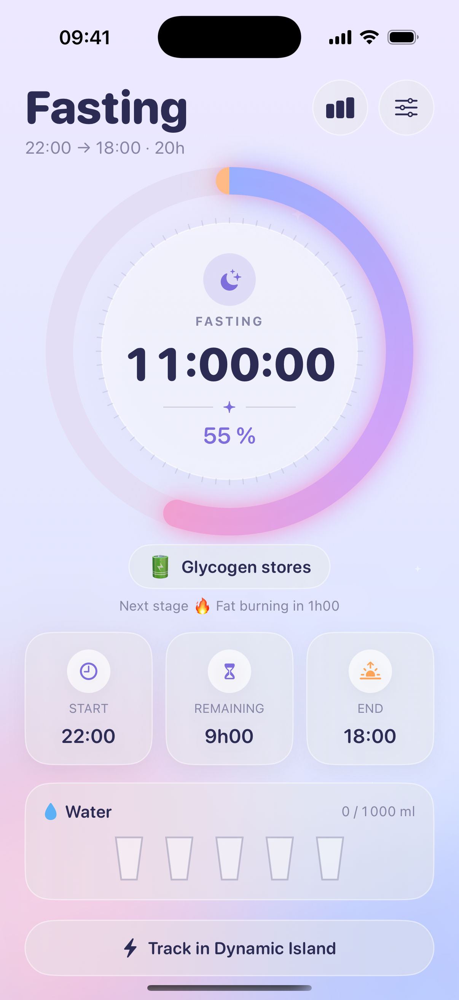 | 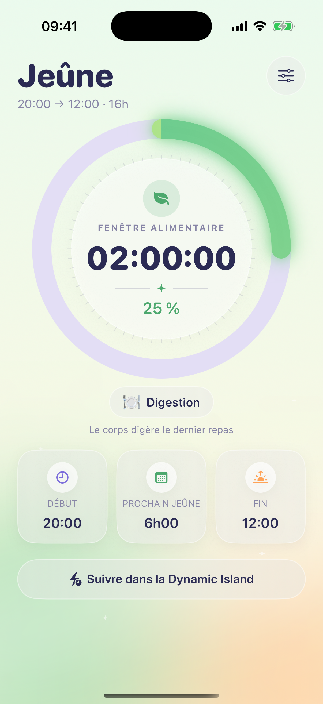 |

| Widgets & Live Activity | Dynamic Island (en situation) |
|:---:|:---:|
| 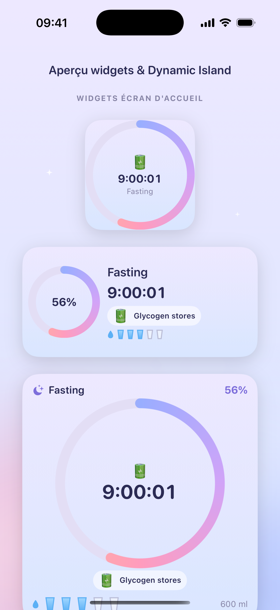 | 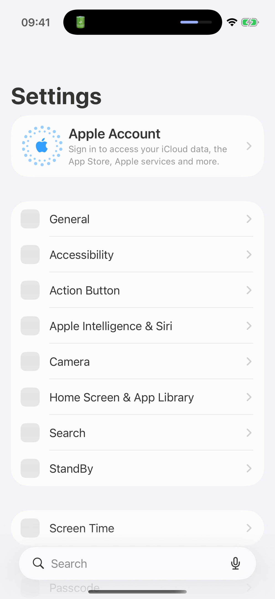 |

| Onboarding | Engagement Crazy Bee Labs (1er lancement) |
|:---:|:---:|
| 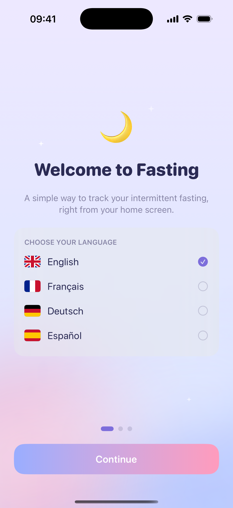 | 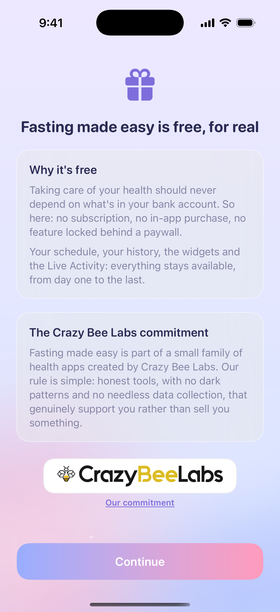 |

| Historique | Icône (écran d'accueil) |
|:---:|:---:|
| 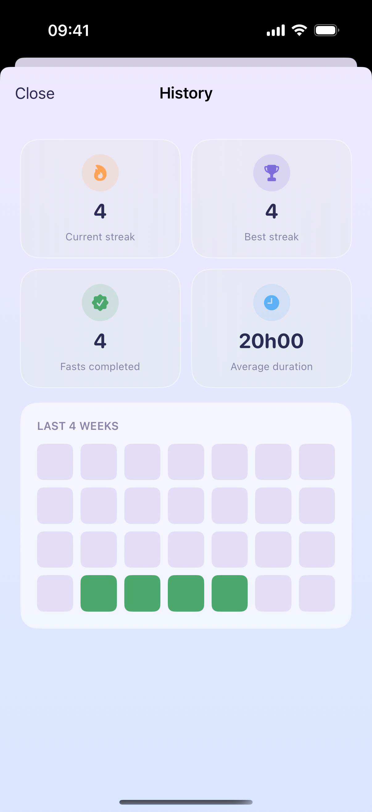 | 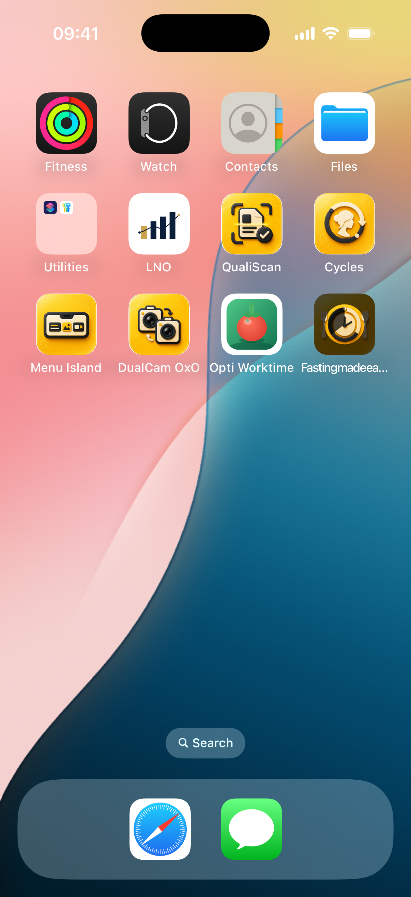 |

| Interrompre le jeûne (tap) | Démarrer le jeûne (tap) |
|:---:|:---:|
| 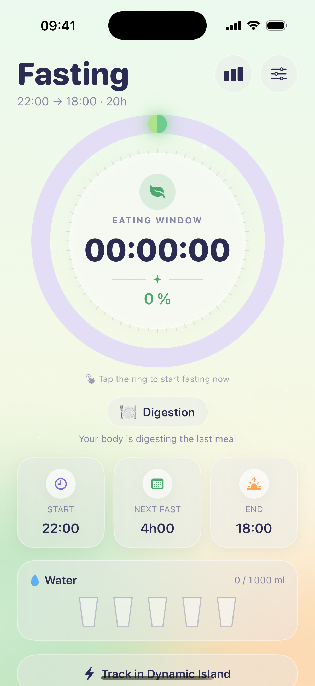 | 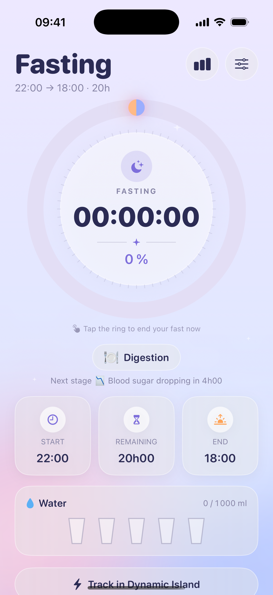 |

| Historique avec interruption |
|:---:|
| 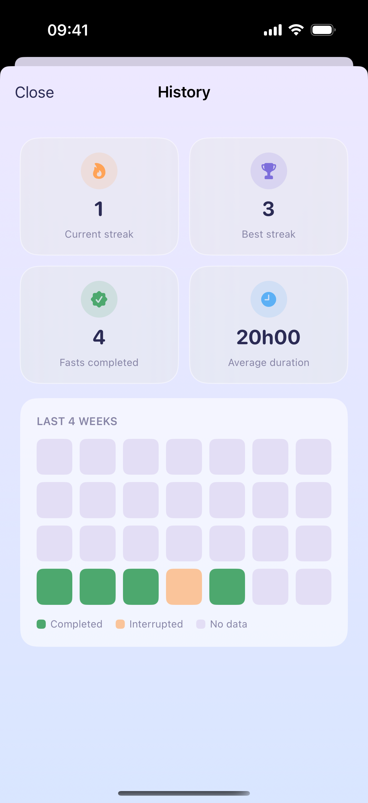 |

| Live Activity — écran verrouillé & CarPlay/Watch (label END + « small family » corrects) |
|:---:|
| 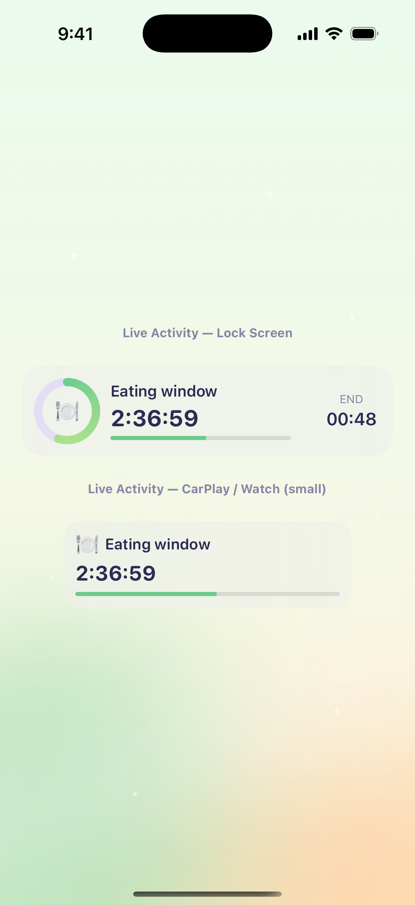 |

## Fonctionnalités
- **Configuration** : heure de **début**/**fin** du jeûne, ou **préréglages rapides** (16:8, 18:6, 20:4, OMAD).
- **Écran principal** : anneau de progression pastel, **temps écoulé** en direct, **état d'avancement** métabolique (Digestion → Glycémie → Glycogène → Combustion des graisses → Cétose → Autophagie), et la phase en cours (jeûne / fenêtre alimentaire). **Un tap sur l'anneau** permet d'**interrompre le jeûne** (avec confirmation) ou de **démarrer un jeûne** à n'importe quelle heure, en dehors du planning — l'app, les widgets et la Dynamic Island s'ajustent immédiatement ; le planning normal reprend automatiquement une fois la session (manuelle) écoulée.
- **Historique & séries** : série en cours / meilleure série, jeûnes complétés, durée moyenne, calendrier des 4 dernières semaines — calculés à partir du planning (pas de check-in requis).
- **Bande « 7 derniers jours »** sur l'écran principal : un anneau par jour avec les **heures réellement jeûnées**, vert + trophée pour un objectif atteint, ambre + étoile pour un jeûne écourté, gris quand rien n'est enregistré, et le jeûne du jour affiché en pointillés tant qu'il tourne.
- **Correction a posteriori** : un **tap sur un jour** de la bande ouvre son éditeur (heure de **début** et de **fin**, date incluse pour les jeûnes qui passent minuit) avec la durée et le statut recalculés en direct, plus un « marquer comme sans jeûne » ; un **tap sur la carte START** corrige l'heure de départ de la **fenêtre en cours** — le chrono, le pourcentage, la carte END, les widgets et la Live Activity repartent immédiatement de cette heure-là.
- **Tracker d'eau** : objectif quotidien réglable (3 à 8 verres), 5 verres cliquables qui se remplissent, état « objectif atteint », **rappels de boire** (notifications espacées dans la journée).
- **Notifications locales** quotidiennes au **début** et à la **fin** du jeûne (+ rappels d'hydratation optionnels), **muettes quand elles contrediraient une session lancée à la main** : un jeûne démarré à 20:00 n'annonce pas « le jeûne commence » à 22:00.
- **Widgets écran d'accueil** (petit/moyen/grand pour le jeûne, le moyen et le grand affichent aussi l'eau + petit widget eau **interactif**, tap direct sur un verre via App Intents iOS 17) + widget rond pour l'écran verrouillé, alimentés via un **App Group** partagé.
- **Live Activity / Dynamic Island** : suivi en direct du jeûne dans la Dynamic Island et sur l'écran verrouillé (chrono et progression qui avancent tout seuls, sans push). Bouton *Suivre / Arrêter le suivi en direct* dans l'app.
- **Premier lancement** : un écran **engagement Crazy Bee Labs** (pourquoi l'app est gratuite — même écran dédié que les autres apps santé gratuites du studio), puis un **onboarding** en 3 pages : bienvenue + choix de la langue, choix du programme de jeûne, notifications.
- **Compte** (optionnel) : Sign in with Apple, lien vers la gestion de l'identifiant Apple (mot de passe/sécurité gérés par Apple), **suppression de compte** qui efface réellement toutes les données locales (planning, eau, historique, préférences). App 100% locale : se connecter n'active aucune synchronisation, ça sert uniquement à avoir une identité pour la conformité App Store.
- **Politique de confidentialité** accessible depuis les réglages.
- **Gratuite** : aucun essai, aucun abonnement — engagement Crazy Bee Labs, présenté au premier lancement et re-consultable à tout moment depuis les réglages.
- **Multilingue** : anglais par défaut, bascule 🇬🇧 / 🇫🇷 / 🇩🇪 / 🇪🇸 dans les réglages (et dès l'onboarding).
- Thème **pastel** (lavande / pêche / menthe) partagé entre l'app, les widgets et la Live Activity.

## Structure
```
Fasting/            target app (écran principal, réglages, notifications, icône)
FastingWidget/      target widget extension (WidgetKit)
Shared/             code partagé app + widget (modèle, store App Group, palette, vues, contenu widget)
Fasting.xcodeproj/  projet Xcode (2 targets : Fasting + FastingWidget)
```
- Bundle id app : `company.lno.fasting` — widget : `company.lno.fasting.FastingWidget`
- App Group : `group.company.lno.fasting`
- Cible iOS minimum : **18.0** (relevé depuis 17.0 le 2026-07 pour la Live Activity CarPlay/Watch —
  voir section dédiée ; app pas encore publiée, donc aucun impact sur des utilisateurs existants)
- Jeûne par défaut : **22:00 → 18:00** (20h de jeûne), modifiable dans l'app ou via les préréglages.
- Icône : `AppIcon.appiconset/AppIcon.png` (1024×1024, sans alpha), source canonique dans
  `~/Desktop/crazybee-icons/Fasting made easy.png` — remplacer les deux si l'icône change.

## Ouvrir / lancer
```bash
open ~/fasting-app/Fasting.xcodeproj
```
Choisir le scheme **Fasting**, un simulateur ou son iPhone, puis ▶︎. Les runtimes simulateur
iOS 18.6 / 26.3 / 26.4 / 26.5 sont installés sur cette machine.

## CI / Build cloud (GitHub Actions)
[](https://github.com/JeremyLNO/fasting-ios/actions/workflows/ios.yml)

À chaque push sur `main`, un runner macOS compile l'app **et** le widget (avec l'icône et les
assets — le cloud dispose du runtime simulateur qui manque en local) et publie le `.app` en
artefact téléchargeable : onglet **Actions** → dernier run → section *Artifacts*.

### Plus tard : distribution TestFlight
Avec un **compte Apple Developer (99 $/an)** :
1. Créer l'app dans App Store Connect (bundle `company.lno.fasting`).
2. Générer une **clé API App Store Connect** (Issuer ID, Key ID, fichier `.p8`).
3. Les ajouter en **secrets** du repo : `ASC_KEY_ID`, `ASC_ISSUER_ID`, `ASC_KEY_P8`.
4. On branche alors un job `archive` signé (signature cloud via `-allowProvisioningUpdates`) →
   upload TestFlight. (Dis-le-moi quand le compte est prêt, je l'ajoute.)

## Installer sur son iPhone

**Config actuelle : App Group ACTIVÉ** (`group.company.lno.fasting` sur les 2 targets) → les
**widgets (eau + jeûne) reflètent l'app** en temps réel. ⚠️ L'App Group **nécessite une équipe
Apple PAYANTE** ; un compte gratuit sera refusé par Xcode.

1. Brancher l'iPhone (USB), déverrouiller, « Se fier à cet ordinateur ».
2. `Signing & Capabilities` des **deux** targets → **Automatically manage signing** →
   **Team** = une équipe **payante** (ex. celle de l'entreprise).
3. Sélectionner l'iPhone comme destination → **⌘R**.
4. iPhone → Réglages → Général → **VPN et gestion d'appareils** → **Se fier** au profil.
5. Widget : appui long sur l'écran d'accueil → **+** → « **Fasting** » ou « **Eau / Water** ».

### Pour signer en GRATUIT (sans partage widget)
Vide les 2 entitlements (`Fasting/Fasting.entitlements` et `FastingWidget/FastingWidget.entitlements`)
en `<dict/>`. Les widgets afficheront alors un placeholder (pas de partage app↔widget), mais l'app
fonctionne et se signe avec un Personal Team gratuit.

## App gratuite (engagement Crazy Bee Labs)
Fasting fait partie des applications gratuites suite à l'engagement de Crazy Bee Labs — aucun
essai, aucun abonnement, aucun paywall. Il n'y a **plus de StoreKit / IAP** dans le projet
(`Store.swift`, `PaywallView.swift`, `Fasting.storekit` ont été retirés) : `RootView` ouvre
directement l'app après l'onboarding, sans aucune vérification de trial. Le premier lancement
(`AppInstall.swift`, ex-`Trial`) sert uniquement de point d'ancrage pour l'historique/séries, plus
pour un compte à rebours payant.

L'engagement est présenté par `Fasting/CommitmentView.swift` : un **écran dédié affiché une seule
fois, avant l'onboarding** (clé `commitment.seen`), reprenant le pattern des autres apps santé
gratuites du studio (cf. `CommitmentView` de Respire) — icône cadeau, carte « pourquoi c'est
gratuit », carte « l'engagement Crazy Bee Labs », logo CBL cliquable vers le site. La vue est
autonome (closure `onContinue`), donc la carte 🐝 des **réglages** la re-présente en sheet sans
dupliquer la moindre mise en page. Localisée EN/FR/DE/ES.

## Historique & séries
`Shared/HistoryStore.swift` reconstruit l'historique **à partir du planning** (pas de check-in
utilisateur) : chaque fenêtre de jeûne entièrement écoulée depuis l'installation est enregistrée
comme complétée. Série actuelle / meilleure série / total / durée moyenne + calendrier des 4
dernières semaines dans l'écran **Historique** (icône graphique, à côté de l'engrenage).

**Les interruptions manuelles sont reflétées fidèlement** : au moment précis où on interrompt un
jeûne (tap sur l'anneau → confirmation), `HistoryStore.logInterruption` enregistre la durée
*réellement* écoulée pour ce jour-là (`completed: false` si en dessous de l'objectif) — c'est le
seul instant où cette info existe, puisque la session manuelle suivante l'écraserait sinon.
`syncIfNeeded` ne réécrit jamais un jour déjà enregistré, donc cette interruption reste définitive.
Dans le calendrier, un jour interrompu apparaît en **orange** (distinct du vert « complété » et du
gris « aucune donnée », avec légende) ; il casse aussi la série et est exclu du total/de la moyenne.

`FastRecord.actualMinutes` stocke la **durée réellement tenue** (optionnel, donc les enregistrements
écrits avant ce champ se décodent toujours — ils retombent sur la cible quand ils étaient complétés).
C'est ce qui permet à `HistoryStore.last7Days(schedule:liveState:)` d'afficher « 10h » sur un jour
écourté plutôt qu'un simple échec binaire, et de montrer le jeûne du jour en cours (`liveState`)
avant qu'il ne soit enregistré. Rendu par `WeekStrip` (`Shared/FastingViews.swift`).

### Corriger un jeûne
`FastRecord` porte aussi `startTime`/`endTime` (optionnels eux aussi) dès qu'un jour a été **édité à
la main**. Deux entrées :

- **Un jour de la bande** → `Fasting/DayEditorView.swift`. Les deux `DatePicker` incluent la **date**
  en plus de l'heure : un jeûne de 20 h se termine le lendemain, sans ça il serait inexprimable.
  L'écran s'ouvre sur les heures enregistrées ; à défaut, sur l'heure planifiée du jour **avec la
  durée déjà loguée** (un jour interrompu à 10 h s'ouvre sur 10 h, pas sur l'objectif — sinon ouvrir
  l'éditeur réécrirait silencieusement l'historique). `HistoryStore.setEntry` recalcule `completed`
  lui-même, donc l'aperçu (trophée / étoile) ne peut pas diverger de ce qui sera enregistré. Le
  record est clé sur le jour où le jeûne a **commencé**, comme partout ailleurs.
  « Marquer comme sans jeûne » écrit un **zéro explicite** plutôt que de supprimer la clé : une clé
  supprimée dont la fenêtre planifiée est déjà passée serait simplement recréée par `syncIfNeeded`.
- **La carte START** (crayon) → `Fasting/StartEditorView.swift`, pour corriger la fenêtre **en
  cours**. Elle enregistre une `ManualSession` ancrée à l'heure choisie, donc le chrono, le
  pourcentage, la carte END, les widgets et la Live Activity en découlent (la session vit dans l'App
  Group). Le picker est borné à `...Date()` : une fenêtre qui commence dans le futur donnerait un
  temps écoulé négatif.

L'écran principal garde un compteur `historyVersion` passé en `.id()` à la bande : `HistoryStore`
étant un store de fichiers et non un `ObservableObject`, c'est ce qui force la relecture après une
édition.

## Tracker d'eau
Objectif réglable (3 à 8 verres, `SharedStore.waterGoal`) dans Réglages, avec rappels optionnels
espacés dans la journée (`NotificationManager.rescheduleWater`). Le petit widget « Eau » est
**interactif** (iOS 17 App Intents, `FastingWidget/WaterIntents.swift`) : taper un verre directement
sur l'écran d'accueil met à jour l'app instantanément (App Group).

## Live Activity : CarPlay/Watch, label de fin, rafraîchissement automatique
- **CarPlay Dashboard & Apple Watch Smart Stack** (`FastingWidget/FastingLiveActivity.swift`) :
  la Live Activity supporte la **« small activity family »** (`@Environment(\.activityFamily)`,
  `.supplementalActivityFamilies([.small])`, iOS 18+). Sans elle, CarPlay retombe sur un pill
  minimal (icône + barre nue, sans aucun texte) — c'est ce qui causait un affichage peu clair.
  Avec elle, CarPlay/Watch affichent le statut (Jeûne/Repas) + le temps restant en toutes lettres,
  en plus de la barre de progression. **C'est la raison du relèvement de la cible iOS à 18.0** :
  SwiftUI n'a pas de mécanisme propre pour brancher `if #available` entre deux configurations de
  widget différentes (`some WidgetConfiguration` et `WidgetBundleBuilder` refusent tous les deux ce
  genre de branchement conditionnel) ; l'app n'étant pas encore publiée, ce relèvement ne coûte rien.
- **Contraste sur fond sombre** (`LiveSmallView`, `Shared/LiveActivityViews.swift`) : CarPlay
  dessine cette carte sur **son** fond sombre et ignore un `activityBackgroundTint` clair — l'encre
  bleu nuit de l'app y était donc quasi invisible. La « small family » est désormais assumée en
  clair-sur-sombre (texte blanc, `activityBackgroundTint(Palette.ink)`, piste de la barre de
  progression éclaircie via `liveBar(_:onDark:)`), ce qui vaut aussi pour le Smart Stack de la
  Watch. **Même correction sur la Dynamic Island étendue**, dessinée sur du noir pur : elle utilisait
  la même encre sombre. Le layout vit dans `Shared/` et l'aperçu in-app (`-widgetGallery`) rend
  exactement la même vue sur le même fond sombre — c'est le seul moyen de juger le contraste sans
  voiture.
- **Label « END » corrigé** : il affichait l'heure de fin **statique** du planning (capturée une
  fois au démarrage de la Live Activity, dans `FastingActivityAttributes`), donc figée sur l'heure
  de fin du *jeûne* même pendant la fenêtre alimentaire. Il est maintenant dérivé de `windowEnd`
  (`LiveActivityData.endTimeLabel`), donc toujours l'heure de fin de la fenêtre **réellement en
  cours**. `FastingActivityAttributes` n'a plus aucune donnée statique.
- **Transition automatique jeûne ↔ repas** : ActivityKit n'offre **aucun moyen purement local** de
  programmer une mise à jour future (il faut soit un push serveur — absent ici, l'app n'a pas de
  backend — soit que l'app tourne exactement au bon moment). Solution best-effort : la Live Activity
  se rafraîchit automatiquement dès que l'app est **ouverte/active** — au changement de phase pendant
  qu'elle tourne (`.onChange(of: s.isFasting)`) et à chaque réouverture (`onAppear`). ⚠️ Si l'app
  reste fermée pendant toute une transition (ex. le jeûne se termine sans que l'app soit rouverte),
  la Live Activity peut rester figée jusqu'à la prochaine ouverture — limite inhérente à une app
  100 % locale sans serveur de push.

## Démarrer / interrompre le jeûne à tout moment
Un **tap sur l'anneau** de l'écran principal bascule immédiatement l'état :
- En jeûne → une **confirmation** (« End fast now ») puis bascule en fenêtre alimentaire à cet instant.
- En repas → démarre un jeûne **immédiatement**, sans confirmation.

Techniquement : `ManualSession` (`Shared/FastingModel.swift`) capture `{isFasting, start,
awaitingRestart}` et prime sur le planning — `FastingSchedule.effectiveState(at:override:)`. Stocké
dans l'App Group (`SharedStore.manualOverride()`), donc **l'app, les widgets et la Dynamic Island**
reflètent tous le même état réel. La Live Activity déjà active est mise à jour en direct
(`LiveActivityManager.refreshIfActive`).

Deux règles gouvernent la suite :

**Un jeûne lancé à la main va jusqu'à l'heure de fin programmée**, quelle que soit sa durée. Démarré
à 20:00 sur un planning 22:00 → 18:00, il fait 22 h et se termine quand même à 18:00 ; démarré à
03:00, il en fait 15. L'heure d'arrivée ne bouge pas — auparavant la session durait sa durée cible,
donc chaque départ anticipé décalait la fin (20:00 + 20 h = 16:00) et faisait déraper le lendemain.

**Un jeûne arrêté prématurément ne redémarre pas tout seul.** L'arrêt pose une session
`awaitingRestart` : le planning est suspendu pendant **toute la fenêtre de jeûne qui est sautée**
(22:00 → 18:00), donc rien ne se relance à 22:00. À la place, deux notifications demandent de le
relancer à la main : une à l'heure prévue, une 30 minutes plus tard
(`NotificationManager`, ids `fast.restart.*`). Passé l'heure prévue, l'écran principal le dit —
« Prêt à jeûner », carte **RETARD** ambre, et un CTA explicite. Une fois la fenêtre sautée écoulée,
le planning reprend normalement : **un** jeûne est sauté, l'app n'est pas suspendue pour autant.

Conséquences traitées avec ces règles :
- `HistoryStore.syncIfNeeded` reconstruit l'historique depuis le planning ; il enregistre désormais
  le jeûne sauté comme **0 h** au lieu d'une réussite (sinon l'app offrait un jeûne jamais fait).
- Les notifications programmées qui tombent dans la session sont muettes, **bornes comprises** pour
  un jeûne sauté : « jeûne terminé, bravo » à 18:00 serait aussi faux que « ton jeûne commence » à
  22:00 (`ManualSession.covers(_:schedule:)`).
- Les étapes métaboliques ne courent plus qu'en jeûne : une fenêtre alimentaire peut maintenant
  durer une journée entière, et elle affirmait « le corps puise dans le glycogène » pendant qu'on
  mange.

### Notifications et sessions manuelles
Une session manuelle **coupe le son** des notifications qu'elle contredirait : si le jeûne a été
lancé à 20:00 alors que le planning dit 22:00, l'app ne prévient pas à 22:00 que « le jeûne
commence » — il tourne depuis deux heures. Même chose pour la notification de fin pendant une
fenêtre alimentaire déclenchée à la main. La règle est unique : **toute occurrence programmée qui
tombe à l'intérieur de la session manuelle est muette** (`ManualSession.covers(_:schedule:)`).

Techniquement, un `UNCalendarNotificationTrigger(repeats: true)` ne sait pas sauter *une* occurrence.
Donc :
- **sans session manuelle** → deux déclencheurs quotidiens répétitifs, comme avant (ils continuent
  de tomber même si l'app n'est jamais rouverte) ;
- **avec session manuelle en cours** → les 14 prochains jours sont programmés un par un (28 requêtes
  au maximum, très en dessous de la limite iOS de 64, rappels d'eau compris), moins les occurrences
  couvertes.

Le retour au régime répétitif se fait au premier passage au premier plan une fois la session
écoulée (`.onChange(of: scenePhase)` dans `ContentView`) — d'où l'horizon limité plutôt qu'un seul
jour : l'app peut rester fermée un moment sans perdre ses notifications.

## Conformité App Store
- **Compte & suppression** (`Fasting/AuthManager.swift`, `AccountView.swift`) : Sign in with Apple
  (capability `com.apple.developer.applesignin` dans `Fasting.entitlements`, nécessite une équipe
  payante comme l'App Group). Pas de backend : l'identité sert uniquement à satisfaire la directive
  App Store 5.1.1(v) (compte + suppression réelle). « Reset password » est délégué à Apple
  (`appleid.apple.com/account/manage`) — il n'y a pas de mot de passe applicatif à réinitialiser.
  La suppression de compte efface planning, eau, historique, préférences, notifications et Live
  Activity (`AuthManager.deleteAccount()`).
- **Contact support** : lien vers `crazybeelabs.com/support/` dans Réglages.
- **Privacy Policy** : lien vers `crazybeelabs.com/privacy-policy/` dans Réglages.
- *(Restore Purchases et la gestion des erreurs StoreKit ne s'appliquent plus : l'app n'a aucun
  achat in-app depuis le retrait du paywall — voir section ci-dessus.)*

## Arguments de lancement (dev uniquement)
- `-skipNotifPrompt` : ne pas demander l'autorisation notifications (captures propres).
- `-skipOnboarding` : saute l'assistant de premier lancement.
- `-onboardingStep <0-2>` : ouvre l'onboarding directement sur une page donnée.
- `-showCommitment` : force l'écran d'engagement Crazy Bee Labs (même s'il a déjà été vu).
- `-demoNow <timestamp>` : fige l'heure « maintenant » (démo).
- `-demoLang <en|fr|de|es>` : force la langue.
- `-demoWater <n>` : fixe le nombre de verres du jour.
- `-demoInstallDaysAgo <n>` : simule une date d'installation passée (pour peupler l'historique/série).
- `-demoManualFast <true|false>` : force une session manuelle (démarrée/interrompue) dès le lancement.
- `-demoInterruptDaysAgo <n>` : enregistre un jeûne interrompu (à moitié) pour le jour `n` (test Historique).
- `-openSettings` : ouvre les réglages au lancement. `-openHistory` : ouvre l'historique.
  `-openAccount` : ouvre l'écran Compte directement.
- `-widgetGallery` : affiche l'aperçu in-app des widgets.
- `-liveActivityGallery` : aperçu dédié Live Activity (écran verrouillé + CarPlay/Watch « small »),
  sans besoin de scroller (utile car ces cartes sont tout en bas de `-widgetGallery`).

## Push notifications (OneSignal)

The `OneSignal-XCFramework` Swift Package (pinned to **5.5.1**, only the
`OneSignalFramework` product) is linked into the app target, the app declares
`aps-environment` (`production`, even in Debug — the real environment is picked by the
provisioning profile, and `development` in a TestFlight build yields a token APNs rejects
in silence), and Push is enabled on the App ID `company.lno.fasting`.

Everything is gated on one constant — `OneSignalPush.appID` in
`Fasting/OneSignalPush.swift`. While it is empty the SDK is never
initialised: no registration, no network call, no permission prompt. Paste the App ID
from onesignal.com ▸ Settings ▸ Keys & IDs to switch push on.

OneSignal carries Crazy Bee Labs announcements and app-update notices only; anything
this app schedules for itself stays a local notification. A tap on a push can only open
an `apps.apple.com` or `crazybeelabs.com` link — the payload is untrusted input.

Still required server-side before any push is delivered: an APNs `.p8` key uploaded to
the OneSignal app (Settings ▸ Platforms ▸ Apple iOS).
